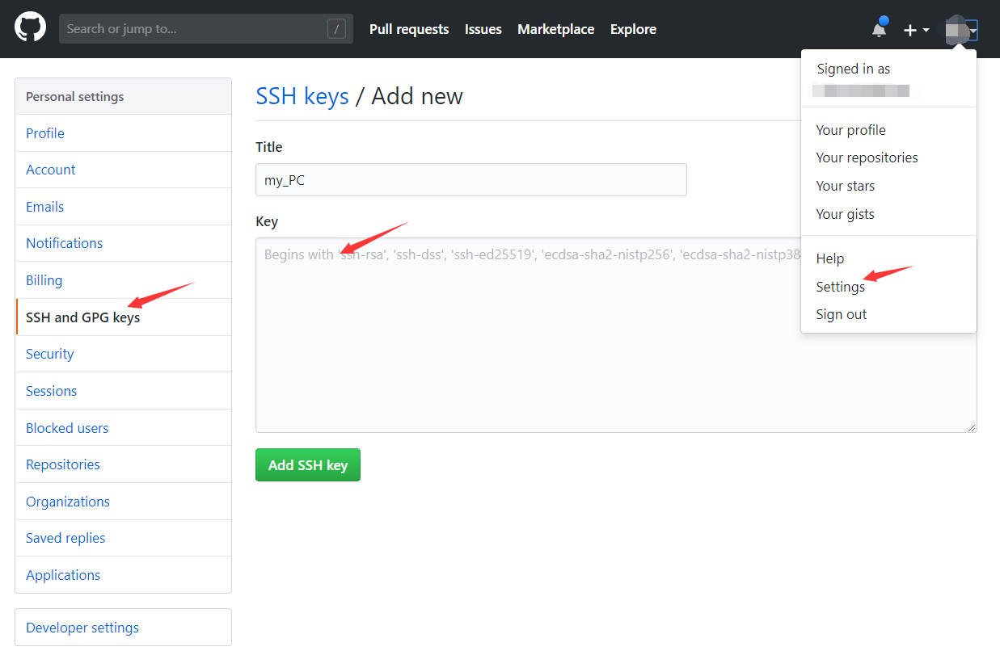

# Git 简易教程

### 基本介绍

Git 是目前世界上最先进的分布式版本控制系统，我们将用它来管理 PA 课设的版本更迭。

### 常见概念

工作区：在你的计算机上能看到的目录。

版本库：又名仓库，是新建版本库时在工作区下生成的一个隐藏目录`.git`（通过 `ls -a` 命令可以看到）。

暂存区：在 Git的版本库中，需要提交的文件修改通通放到暂存区，然后一次性提交暂存区的所有修改 。


### 常用指令

1. 安装 `git`

    ```bash
    sudo apt-get install git
    ```

2. 配置 `git`

    ```bash
    git config --global user.name "Your Name"
    git config --global user.email "email@example.com" 
    ```

3. 创建版本库

    ```bash
    git init #在当前路径下创建仓库
    ```

4. 添加文件到当前仓库

    ```bash
    git add readme.txt
    git commit -m "write a readme file"	#描述此次改动的说明信息
    ```

5. 查看提交历史

    ```bash
    git log	#每次改动之前提交的说明信息
    ```

6. 版本回退

    ```bash
    git reflog #先用 git log/reflog 查看commitID
    git reset --hard commitID
    git reset --hard HEAD^ #回退到上一个版本
    ```

7. 删除版本库中的文件

    ```bash
    git rm readme.txt
    ```

8. 还原误删的工作区的文件

    ```bash
    git checkout --readme.txt 
    ```

    `git checkout` 其实是用版本库里的版本替换工作区的版本

9. 克隆远程库到本地

    ```bash
    git clone https://github.com/your_github_name/your_hub.git #https速度较慢
    git clone git@github.com:your_github_name/your_hub.git#克隆在当前目录下
    ```

10. 本地仓库关联远程库

   - 创建`SSH Key`的秘钥对

     ```bash
     ssh-keygen -t rsa -C "your_email@example.com"	#一开始配置的git的邮箱
     ```

     输完这条命令之后一路回车不需要设置各种密码，然后在`/root`目录下进入.ssh文件 ，`id_rsa`为私钥（不能泄露）， `id_ras.pub` 为公钥。到自己的 github 的 `Settings`下的`SSH and GPG keys`下添加自己的公钥即可。

     

   - 本地仓库关联

     ```bash
     git remote add origin git@github.com:your_github_name/your_hub.git
     git push -u origin master	#第一次推送master分支的所有内容
     git push origin master	#推送最新修改
     ```

     如果这是一个非空仓库，需要`git pull origin master`，将远程的代码拉到本地。

11. 创建与合并分支

    - 查看所有分支

      ```bash
      git branch
      ```

      在 `master` 分支下创建 `pa1` 分支，然后切换到 `pa1` 分支

      ```bash
      git checkout -b pa1
      ```

      以上命令相当于以下两条命令：

      ```bash
      git branch pa1 		#创建分支pa1
      git checkout pa1	#切换到分支pa1
      ```

      执行之后，目前在 `pa1` 分支上，可以用 `git branch` 命令查看。

    - 在 `pa1` 分支下开发

      ```bash
      git add file
      git commit -m '..."
      ```

      跟 `master` 下开发更迭并无两样。当前版本开发完成之后，切回到 `master` 分支：

      ```bash
      git checkout master
      ```

    - 合并删除 `pa1` 分支

      ```bash
      git merge pa1 
      git branch -d pa1
      ```

      对于不需要合并的分支可以通过 `git branch -D pa1` 删除。

12. 解决冲突

    当分支 `pa1` 与 `master` 都有新的提交时，执行 `git merge pa1` 之后只能手动修改文件（尽管有提示不同分支的代码区别，但是依旧很麻烦），最好的做法就是避免这种情况的发生。对于 PA 项目管理，我们给出的建议是当新建分支之后，master 分支上就不要再做提交，直到子分支合并到 master 之后再提交到远程仓库。

13. 推送到远程仓库

    ```bash
    git remote -v 			 #查看远程信息库
    git remote remove origin #删除origin远程库
    git push origin master 	 #将master上版本推送到origin上
    ```

### 补充说明

Git 的更多应用如多人协作开发版本更迭、当前正在子分支上开发但是突然发现主分支上有 Bug 等等由于不牵扯到 PA 项目的管理所以在此不做介绍，具体可以自行在网上搜索。