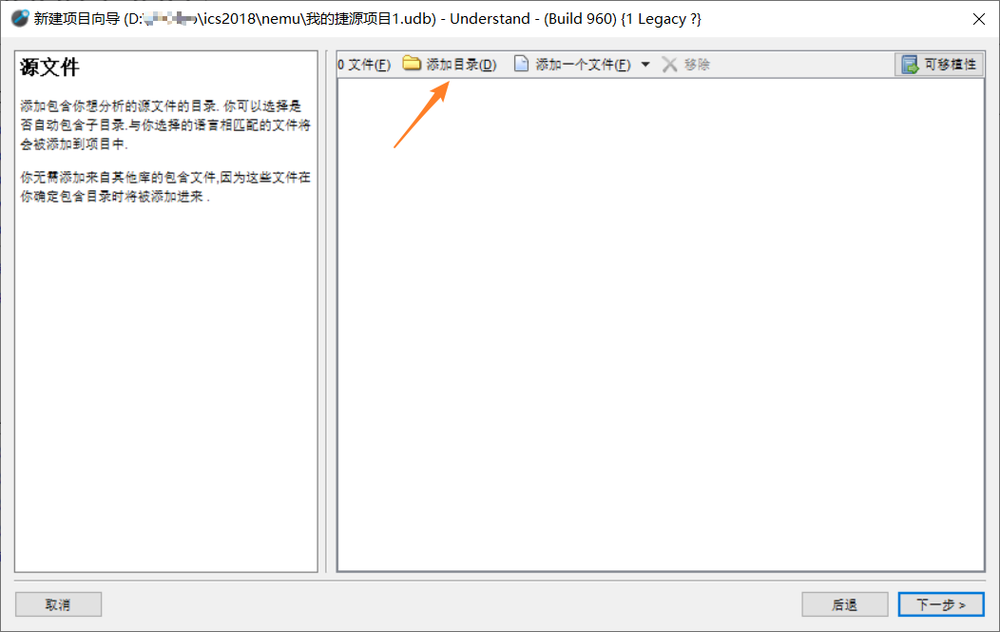
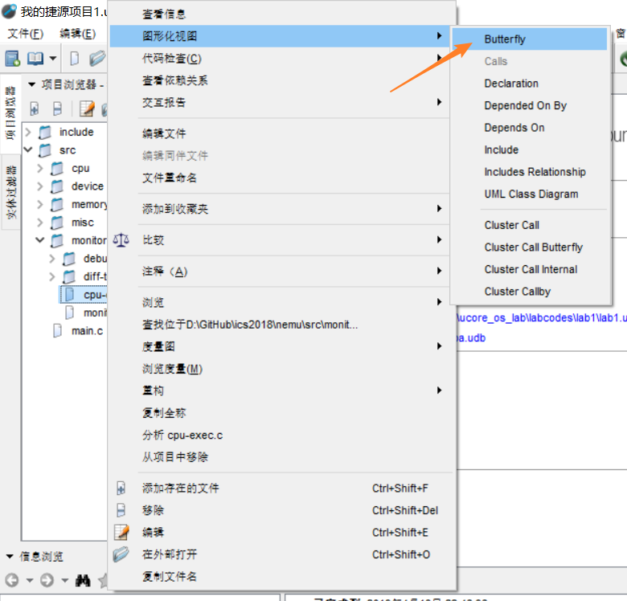
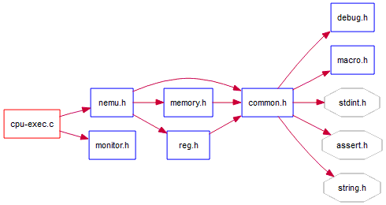
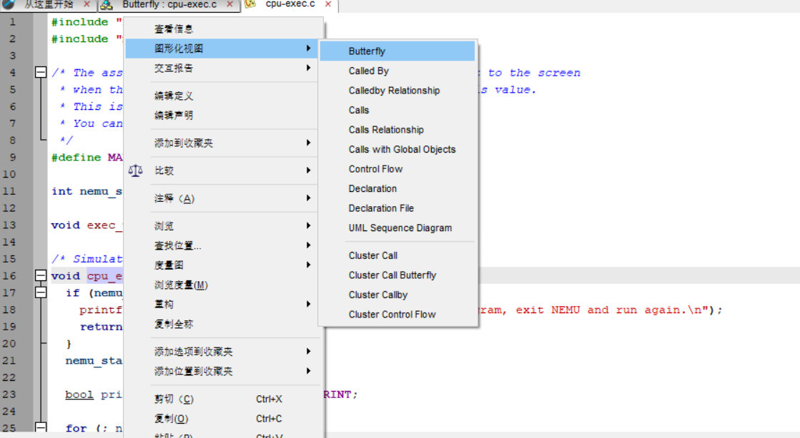
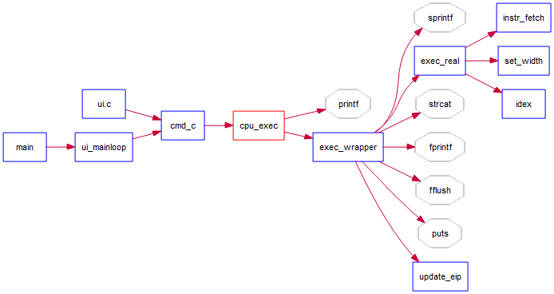

# 软件推荐

## Understand

Understand 是一个高效的代码静态分析的软件，它可以绘制各种流程图。除此之外，Understand 支持 Windows、Linux 和 Mac 多平台。下面简要的介绍它的功能。

以初始化后的 nemu(branch: PA0) 为例，打开 Understand 后操作顺序如下：

```
文件 -> 新建 -> 项目
```

然后定位到 nemu 文件夹，按照默认配置进入下面的界面：



添加 nemu 的目录，一般来讲，如果你之前就在 nemu 文件夹下面建立项目的话默认文件就可以了。当然，这个操作过程会产生 `.udb` 文件，这不是提交时需要的文件，你可以把它添加入 .gitignore 中。如果不知道 `gitignore` 是什么的话，可以在[Git-基础-记录每次更新到仓库](https://git-scm.com/book/zh/v2/Git-%E5%9F%BA%E7%A1%80-%E8%AE%B0%E5%BD%95%E6%AF%8F%E6%AC%A1%E6%9B%B4%E6%96%B0%E5%88%B0%E4%BB%93%E5%BA%93)中阅读**忽略文件**这一段，然后思考怎样把生成的无关文件添加进去。

在创建好项目之后，在左侧的项目浏览器中可以看到目录的结构。以 `cpu-exec.c` 为例：

```
右击 -> 图形化视图 -> Butterfly
```



接下来在主窗口可以得到这样的图形：



是不是很清爽地就可以看见文件调用了呢？

别急，还有更加方便的功能哦。

进入 `cpu-exec.c` 文件，以其中的 `cpu_exec` 函数为例，我们在函数名称上进行同样的操作：



可以得到类似的 butterfly graph：



这是函数调用。Understand 不但支持分析文件调用，而且还支持分析函数调用。它甚至可以自动分析展开宏。

我想经过上面的演示，你可以大概了解这款软件的意义和作用了吧？<del>就算只会这个功能，</del>它可以方便地辅助我们分析代码框架。感兴趣的同学可以去试一试哦~